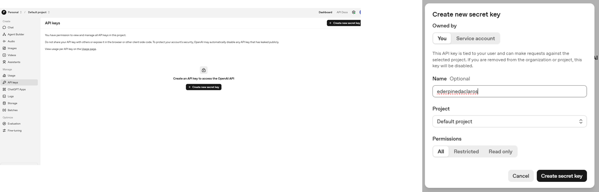
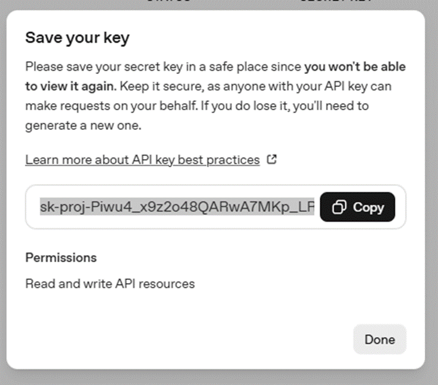

# Taller : Creando aplicaciones de Inteligencia Artificial Generativa

El objetivo de este taller es construir una línea de tiempo que permita comprender la evolución de la inteligencia
artificial, desde los fundamentos de la estadística hasta las
arquitecturas agénticas modernas. Esto ayudará a entender cómo han evolucionado los modelos y 
las técnicas hasta llegar a los sistemas actuales de IA generativa.

El taller se divide en las siguientes sesiones:

- **Sesión 01:** IA Generativa + Embeddings  
- **Sesión 02:** RAG + LangChain  
- **Sesión 03:** Agentes y Multiagentes  
- **Sesión 04:** Taller práctico de agentes con AWS, GCP y Azure

Para iniciar el proceso de aprendizaje, comenzaremos habilitando nuestro ambiente de trabajo. Para ello, seguiremos los siguientes pasos:

### Paso 1 : Habilitar espacio de trabajo

Codespaces es un entorno de desarrollo instantáneo basado en la nube que usa un contenedor para proporcionar lenguajes comunes, herramientas y utilidades para el desarrollo.

Creamos un Codespaces, clic en Code -> Codespace -> Create codespace on master.

En el terminal de Codespaces ejecuta este comando para instalar las librerías necesarias para el curso:

### Paso 2 : Crear API KEy en openAI

Luego entra directamente a:
https://platform.openai.com/api-keys
Ahí verás la sección API Keys

Crea y copia tu API Key

### Paso 3: Instalación de librerias

Clase 1: Instalar librerias en codespace

	pip install openai streamlit tiktoken Pillow sentence_transformers
	python -m pip install --upgrade pip
	echo "Completado"

Clase 2 : Instalar

	pip install -U pip setuptools wheel
	pip install replicate pypdf pydub boto3 
	pip uninstall -y langchain langchain-core langchain-openai langsmith langgraph langchain-community
    pip install "langchain" "langchain-openai"
    pip install langchain-community
	pip install langchain-text-splitters
	pip install -U langchain-pinecone
	pip install -U langchain-classic
	pip install -U faiss-cpu
	pip install -U langchain-qdrant qdrant-client

En el repositorio no se podrán subir cambios, para descargar los cambios ejecutar estos dos comandos en el terminal de Codespaces:

	git checkout -f
	git pull

